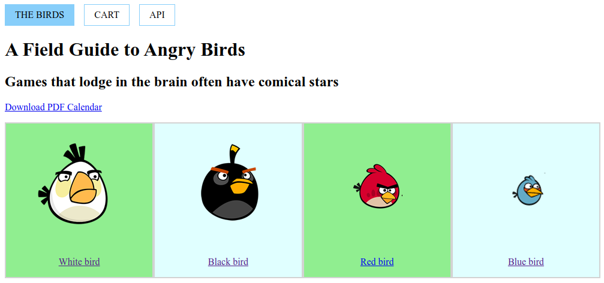
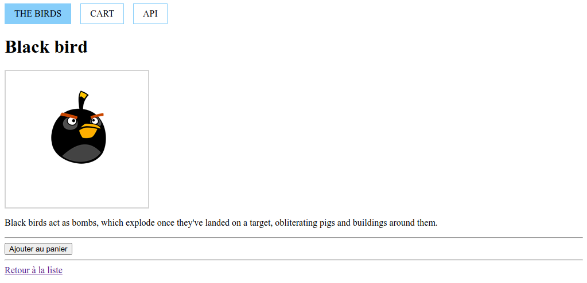
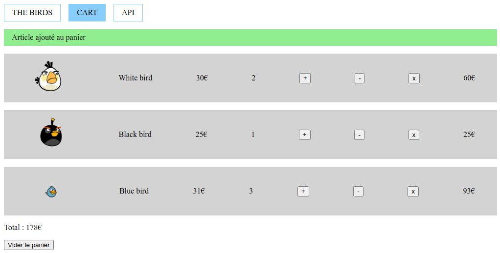

# Angry Birds e-commerce

## Objectifs

- Créer un panier pour acheter les peluches des oiseaux.
- Mettre en place les bonnes pratiques de développement web.

## Les tâches à réaliser

### Navigation

### Ajout au panier

On aura besoin d'utiliser la session, voir https://symfony.com/doc/current/controller.html#managing-the-session

### Page panier

:hand: Ici on peut se contenter de n'afficher que les infos des oiseaux en session, on peut mettre de côté la fonctiionnalité "Panier" et parler de "Wishlist".

### Contrôleurs

&lt;/Challenge&gt;

- Dans la page détail oiseau, ajouter un bouton "Add to cart" (en POST), qui va stocker en session, l'id de l'oiseau. On veut pouvoir y ajouter tous les oiseaux. On va donc stocker ces ids dans un tableau. Indice à l'ajout : _on récupère le panier de la session, on y ajoute l'id demandé, on remet le nouveau panier dans la session_. Voir https://symfony.com/doc/current/controller.html#managing-the-session

    - Formulaires : [**Passer par l'objet Request**](http://symfony.com/doc/current/controller.html#the-request-and-response-object) pour récupérer les paramètres POST.
        > Note: **Nous n'utilisons pas les formulaires Symfony pour le moment**.
        - Puis [rediriger vers la page voulue, via la méthode fournie par Symfony](https://symfony.com/doc/current/controller.html#redirecting).

- Sur la page "Cart", on dump le panier qui est en session.

- **Ajouter les pré-requis sur les méthodes GET, POST ou les deux pour chaque méthode de contrôleur**, voir [requirements => Adding HTTP method requirements](https://symfony.com/doc/current/routing.html#matching-http-methods).

- **Définir des requirements** sur toutes les routes où c'est nécessaire : [_requirements_](https://symfony.com/doc/current/routing.html#parameters-validation) et les Regex).

&lt;Bonus&gt; 

- Afficher l'image, le nom et le prix de chaque oiseau dans le panier.
    - :hand: Ici on peut se contenter de n'afficher que les infos des oiseaux en session, on peut mettre de côté la fonctiionnalité "Panier" et parler de "Wishlist".
    - Trouver un moyen à l'ajout au panier d'éviter les doublons (chaque oiseau ne doit être référencé qu'une seule fois).

- **Ajouter des _[Flash Messages](https://symfony.com/doc/current/controller.html#flash-messages)_** dans les contrôleurs sur les actions de mise en panier ou modification du panier.

> _Les messages flash sont des variables stockées en session. Leur particularité est que, dès qu’ils ont été récupérés, ils sont aussitôt supprimés de la session. Parfait pour envoyer une notification juste après une opération)_. Cela fait en outre partie des bonnes pratiques Opquast :wink: cf BP 97 et BP 98 (formulaires : message et redirection)

 - Puis [rediriger vers la page appropriée](https://symfony.com/doc/current/controller.html#redirecting).

 - Afficher les flash messages sur la destination de la redirection (ou dans le layout global mais cela peut être moins précis). Tenter d'appliquer le style [Alert Bootstrap](https://getbootstrap.com/docs/4.5/components/alerts/) correspondant.

 - &lt;/Bonus&gt;

&lt;/Challenge&gt;
 
- **Effectuer les vérifications de validité de certaines actions** (comme _/bird/4_ par ex.) : [Renvoyer une 404](https://symfony.com/doc/current/controller.html#managing-errors-and-404-pages) si l'oiseau demandé n'existe pas. Identifier toutes les routes où la 404 peut être envoyée.

- Pour l'action _delete_ **utiliser une méthode POST** (un formulaire donc).

> Note: **N'utilisez pas les formulaires Symfony pour le moment**, un formulaire HTML classique suffira.

### Templates

- Jetez un oeil du côté de [l'include de Twig](https://symfony.com/doc/current/templates.html#including-templates) (partial, fragment) si besoin de mutualiser du code HTML/Twig sur plusieurs pages.

- Mettre un titre HTML (balise `title`) différent à chaque page (héritage !).

### Bonus

- Rendre la sélection du menu dynamique, selon la route de la page courante.
   - Possibilité 1 : Twig et la variable globale [`app`](https://symfony.com/doc/current/templates.html#the-app-global-variable)
   > Note: La fonction `` et `{{ dump() }}` fonctionne aussi dans les templates.
   - Possibilité 2 : Il existe peut-être une autre solution, si quelqu'un a une idée...
- Modifier le code actuel pour pouvoir réaliser les modifications du panier en AJAX/fetch.

### Mega Bonus

- Ajouter un système de favoris (oiseaux).
- Ajouter un système de code promo sur le panier.
- Ajouter un message "cadeau" sur le panier (De la part de + Message par exemple).
- Afficher une page 404 personnalisée.
